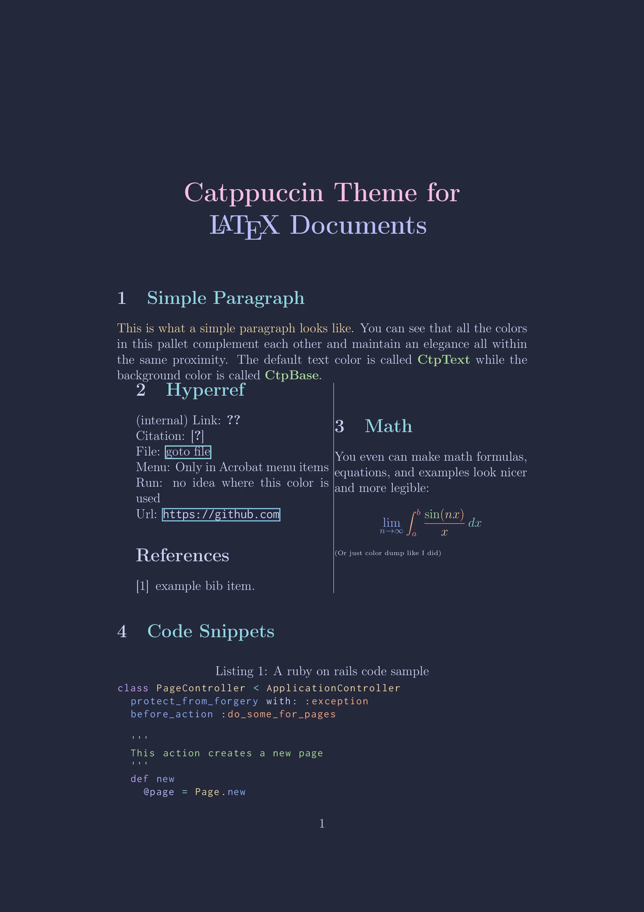

<h3 align="center">
	 
	
	Catppuccin for <a href="https://www.latex-project.org/">LaTeX</a>
	
</h3>

  
  
  

	

## Previews

🌻 Latte

🪴 Frappé

🌺 Macchiato

🌿 Mocha

## Usage

### Importing the theme file
1. At the moment this package is on CTAN, but probably not included in your texlive installation. As a result you have to install it manually:
    - Shortcut: If you set up your local `texmf` you should be able to simply install by executing `make install` (this installs the package locally for the current user)
    - If you don't like installing the package locally for the current user you might also execue `l3build unpack` and move the generated `.sty` file `build/unpacked/catppuccinpalette.sty` to the root directory of your project.
    - If you don't have `l3build` available, you can also download the `catppuccinpalette.sty` artifact from the latest [workflow run](https://github.com/atticus-sullivan/catppuccinLatex/actions), unpack it, and move `.sty` file to your project root.
2. Import the package by adding `\usepackage[FLAVOR]{catppuccinpalette}`, replacing `FLAVOR` with the flavor of your choice. i.e. `\usepackage[macchiato]{catppuccinpalette}`. Valid options are: mocha (default), latte, frappe, and macchiato.
    - If you want the package not only to add color definitions, you can also pass `textcolor=true` and/or `pagecolor=true` to the `catppuccinpalette` package.
    - Also note that in the pdf containing the documentation, the available options are described in more detail and also the defined colors are listed and shown.

### Color Naming Conventions

All [Catppuccin palette colors](https://github.com/catppuccin/catppuccin#-palette), across all flavors, follow the same naming convention. This theme set prefixes all Catppuccin colors with `Ctp`, i.e. `CtpPeach`, or `CtpBlue`. 

### Examples

Please refer to the [examples](https://github.com/catppuccin/latex/tree/main/examples) for full demonstrations, with LaTeX sources and their outputs, on theme usage and code highlighting.

## 💝 Thanks to

- [Lukas](https://github.com/atticus-sullivan)
- [Brandon](https://github.com/walshyb)

&nbsp;

	

	Copyright &copy; 2021-present <a href="https://github.com/catppuccin" target="_blank">Catppuccin Org</a>

	

