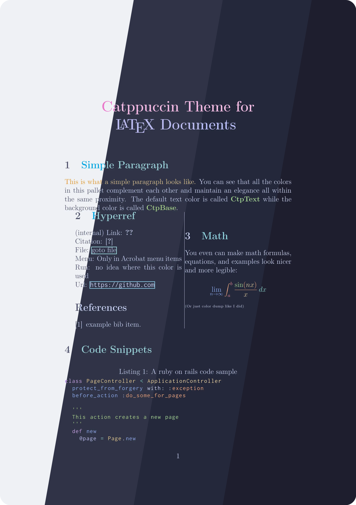
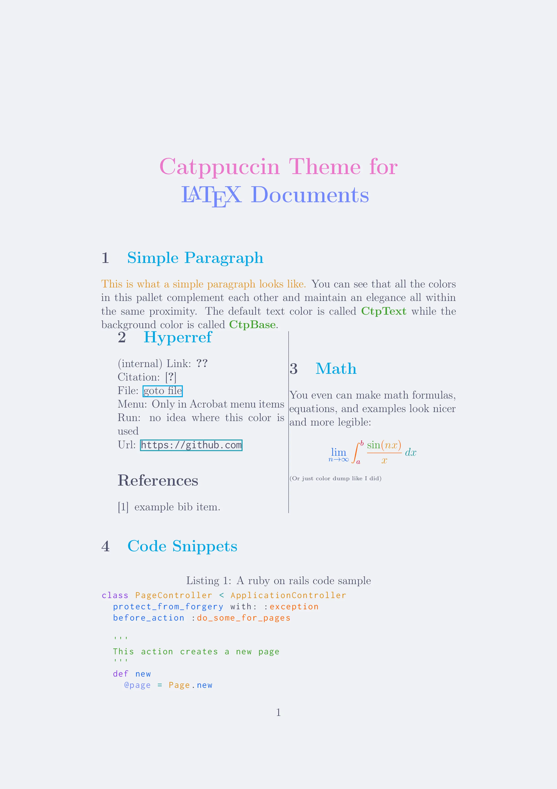
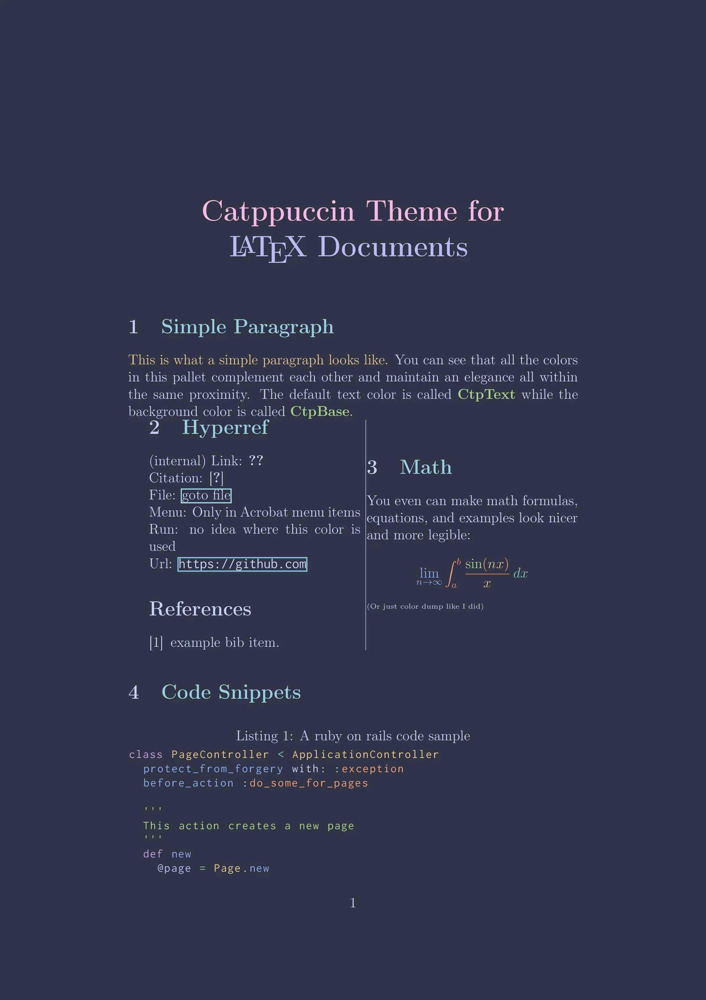
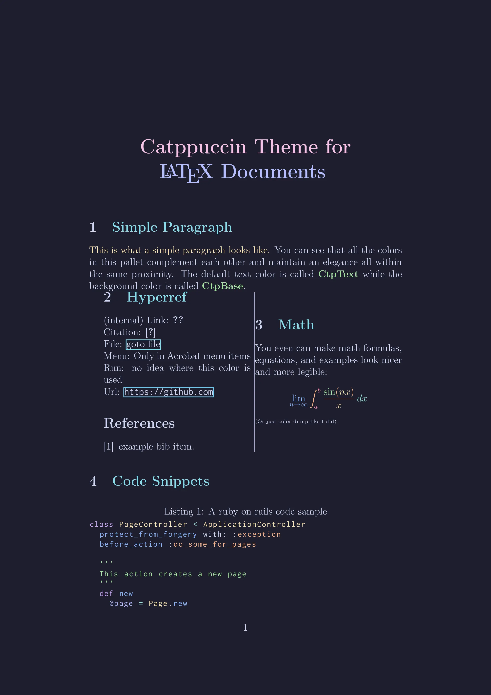

<h3 align="center">
	<br/>
	
	Catppuccin for <a href="https://www.latex-project.org/">LaTeX</a>
	
</h3>

<p align="center">
  <a href="https://github.com/catppuccin/latex/stargazers"></a>
  <a href="https://github.com/catppuccin/latex/issues"></a>
  <a href="https://github.com/catppuccin/latex/contributors"></a>
</p>

<p align="center">
	
</p>

## Previews

<details>
<summary>🌻 Latte</summary>

</details>
<details>
<summary>🪴 Frappé</summary>

</details>
<details>
<summary>🌺 Macchiato</summary>

</details>
<details>
<summary>🌿 Mocha</summary>

</details>

## Usage

### Importing the theme file

1. Download the `.sty` theme file from this repository that you'd like to use in your LaTeX document 
2. Add it to the root of your project, alongside your LaTeX document
3. Import the package by adding `\usepackage[FLAVOR]{catppuccin}`, replacing `FLAVOR` with the flavor of your choice. i.e. `\usepackage[macchiato]{catppuccin}`. Valid options are: mocha (default), latte, frappe, and macchiato.

### Copying and Pasting

If you'd like, you could also just copy the color definitions from the your desired `.sty` theme file. Ensure that you still require the `xcolor` package (`\usepackage{xcolor}`) and still bring in the `\pagecolor` and `\color` definitions.

### Color Naming Conventions

All [Catppuccin palette colors](https://github.com/catppuccin/catppuccin#-palette), across all flavors, follow the same naming convention. This theme set prefixes all Catppuccin colors with `ctp`, i.e. `ctpPeach`, or `ctpBlue`. 

### Overriding Default Page and Text Colors
If you wish to only utilize the themes for code snippets and not the document itself:
1. If you are importing the package from its `.sty` file, reset the default colors by adding the following after the package import:
```
\pagecolor{white}
\color{black}
```
2. If you copied and pasted `.sty` contents into your preamble, ensure that you omit the `\pagecolor` and `\color` definitions

### Examples

Please refer to the [examples](https://github.com/catppuccin/latex/tree/main/examples) for full demonstrations, with LaTeX sources and their outputs, on theme usage and code highlighting.


## Inspiration

Inspired by [Dracula's LaTeX theme](https://github.com/dracula/latex).

## 💝 Thanks to

- [Brandon](https://github.com/walshyb)

&nbsp;

<p align="center">
	
</p>

<p align="center">
	Copyright &copy; 2021-present <a href="https://github.com/catppuccin" target="_blank">Catppuccin Org</a>
</p>

<p align="center">
	<a href="https://github.com/catppuccin/catppuccin/blob/main/LICENSE"></a>
</p>

